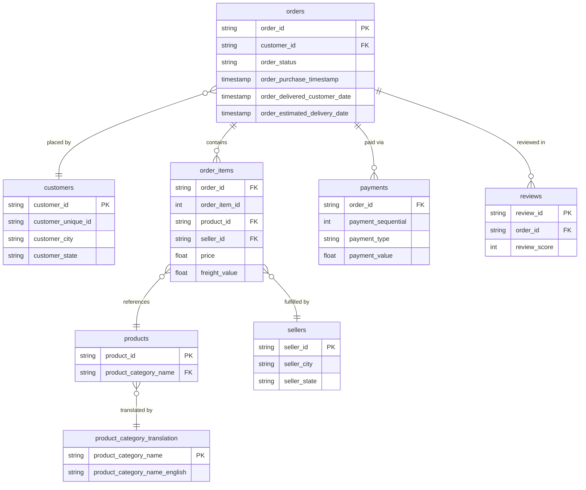

# Data Model & ETL Narrative
## Olist Brazilian E-Commerce — BigQuery Analytics Pipeline

---

## Overview

This document describes the data model, transformation decisions, and pipeline logic behind the two analytics projects in this portfolio. The source data is the [Olist Brazilian E-Commerce dataset](https://www.kaggle.com/datasets/olistbr/brazilian-ecommerce/data) — a real-world relational dataset spanning 100K+ orders across 8 tables, covering the period October 2016 to August 2018.

The pipeline follows a classic **Extract → Transform → Load → Visualise** structure:

| Stage | Tool | Description |
|-------|------|-------------|
| **Extract** | Kaggle / CSV | Raw CSVs ingested into Google BigQuery |
| **Transform** | BigQuery SQL | Cleaning, deduplication, joins, business logic |
| **Load** | BigQuery | Clean analytical tables ready for BI consumption |
| **Visualise** | Looker Studio / Power BI | Dashboards connected to transformed output |

---

## Schema Diagram

The raw dataset consists of 8 relational tables. The diagram below shows all tables, their key fields, and the relationships between them.



---

## Table Descriptions

### `orders`
The central fact table of the dataset. Each row represents one order, with status, timestamps for purchase, delivery, and estimated delivery date. All queries filter on `order_status = 'delivered'` to ensure only completed transactions are analysed.

### `customers`
One row per customer per order. Note: `customer_id` is order-scoped, not unique per person. `customer_unique_id` is the true unique customer identifier — this distinction matters for repeat purchase analysis (see Query 3 and Query 5).

### `order_items`
Granular line-item table. One row per item within an order — a single order can contain multiple rows if it includes multiple products or sellers. Contains `price` and `freight_value` which are the two core financial metrics used across all revenue and margin calculations.

### `payments`
One row per payment event per order. Orders can have multiple payment rows when customers split payment methods (e.g. credit card + voucher). Aggregating `SUM(payment_value)` per `order_id` gives total order value.

### `products`
Product catalogue with category names in Portuguese. Joined to `product_category_translation` to surface English names for all analytical outputs.

### `sellers`
Individual seller registry. Joined via `order_items.seller_id` to profile seller-level performance in Query 9.

### `reviews`
Post-delivery customer reviews. One review per order. Contains `review_score` (1–5) used for seller quality scoring in Project 2.

### `product_category_translation`
Lookup table mapping Portuguese category names to English equivalents. Used with `COALESCE` to handle categories missing from the translation table — defaulting to the original Portuguese name rather than dropping the row.

---

## Key Transformation Decisions

### 1. Delivered orders filter
All queries apply `WHERE order_status = 'delivered'` as the base filter. This excludes cancelled, processing, and shipped-but-undelivered orders from revenue and customer metrics, ensuring only completed commercial transactions are counted.

### 2. COALESCE for category name handling
The `product_category_translation` table does not cover every category in the dataset. Rather than losing uncategorised products, all queries use:

```sql
COALESCE(t.product_category_name_english, p.product_category_name, 'Uncategorized')
```

This waterfall logic prioritises the English translation, falls back to the original Portuguese name, and only assigns 'Uncategorized' if both are null — minimising data loss.

### 3. Payment aggregation
Because `payments` contains multiple rows per order (split payment methods), all payment joins use `SUM(payment_value)` grouped by `order_id` before joining to `orders`. Joining without aggregation first produces inflated revenue figures — a common fan-out trap in multi-row payment tables.

### 4. Customer identity disambiguation
The `customers` table uses `customer_id` as an order-scoped key, not a true unique customer identifier. Query 3 (RFM segmentation) and Query 5 (cohort retention) both use `customer_unique_id` from the `customers` table to correctly identify repeat behaviour across orders.

### 5. Tech category filtering (Project 2)
Project 2 applies a consistent category filter across all four queries to scope analysis to tech products only:

```sql
WHERE COALESCE(t.product_category_name_english, p.product_category_name)
  IN (
    'computers_accessories',
    'electronics',
    'telephony',
    'computers',
    'tablets_printing_image',
    'audio',
    'consoles_games'
  )
```

This filter is applied after the `COALESCE` resolution to ensure it catches both translated and untranslated category names correctly.

---

## Data Quality: Bug Identification & Resolution

During development of Query 8 (Delivery & Operations), on-time delivery rates initially returned values exceeding 100% — an immediate signal of a data integrity issue.

**Root cause:** The `order_items` table contains one row per item, not per order. Joining `orders` to `order_items` without deduplication first produced multiple rows per order — one for each item in the basket. When `COUNTIF(delivery_status = 'On Time')` was then divided by `COUNT(order_id)`, the denominator included the inflated item-level count while the numerator counted each on-time order multiple times, producing rates above 1.0.

**Resolution:** A `DISTINCT` deduplication step was added at the CTE level before the rate calculation:

```sql
delivery_metrics AS (
  SELECT DISTINCT
    order_id,
    category,
    ...
    CASE
      WHEN delivery_date <= estimated_date THEN 'On Time'
      ...
    END as delivery_status
  FROM tech_orders
)
```

By deduplicating to one row per `order_id` before the aggregation step, the `COUNTIF / COUNT(DISTINCT order_id)` calculation produces correct on-time rates (confirmed at 92% across tech orders).

**Lesson:** In multi-item order datasets, always verify the grain of your join before aggregating. An unexpectedly high metric is often a fan-out, not a business win.

---

## Pipeline Flow

```
Kaggle CSV Export
      │
      ▼
Google BigQuery (raw tables)
      │
      ├── orders
      ├── customers
      ├── order_items
      ├── payments
      ├── products
      ├── sellers
      ├── reviews
      └── product_category_translation
      │
      ▼
SQL Transformation Layer (9 queries)
      │
      ├── Project 1 — Sales & Customer Analytics
      │     ├── Q1: Monthly sales performance (LAG window function)
      │     ├── Q2: Top products by revenue (ARRAY_AGG)
      │     ├── Q3: Customer segmentation — RFM (NTILE)
      │     ├── Q4: Geographic distribution (ROW_NUMBER PARTITION BY)
      │     └── Q5: Cohort retention analysis (DATE_TRUNC, self-join)
      │
      └── Project 2 — Tech E-Commerce Analytics
            ├── Q6: Tech category performance (DENSE_RANK, margin calc)
            ├── Q7: Tech top products (ARRAY_AGG, category filter)
            ├── Q8: Delivery & operations (DATE_DIFF, COUNTIF, dedup)
            └── Q9: Seller performance (composite tier classification)
      │
      ▼
BI Layer
      ├── Looker Studio — Project 1 dashboard (3 pages)
      └── Power BI — Project 2 dashboard (3 pages)
```

---

## SQL Techniques by Query

| Query | Key Techniques |
|-------|---------------|
| Q1 Monthly Sales | CTEs, `LAG` window function, `FORMAT_DATE` |
| Q2 Top Products | CTEs, `ARRAY_AGG`, `ARRAY_LENGTH`, multi-table JOINs |
| Q3 Customer Segmentation | CTEs, `NTILE`, `DATE_DIFF`, `CASE` segmentation logic |
| Q4 Geographic Distribution | CTEs, `ROW_NUMBER`, `PARTITION BY` |
| Q5 Cohort Retention | CTEs, `DATE_TRUNC`, `DATE_DIFF`, self-join |
| Q6 Tech Category Performance | `DENSE_RANK`, margin calculations, category filter |
| Q7 Tech Top Products | `ARRAY_AGG`, `ARRAY_LENGTH`, category filter |
| Q8 Delivery & Operations | `DATE_DIFF`, `COUNTIF`, `CASE`, `DISTINCT` deduplication |
| Q9 Seller Performance | Multi-CTE vendor scorecard, composite `CASE` tier logic |

---

## Dataset Notes

- **Period covered:** October 2016 – August 2018
- **Total orders (delivered):** ~96,500 (Project 1) / 15,110 tech orders (Project 2)
- **Tables used:** All 8 tables across both projects
- **Known limitation:** Near-zero repeat purchase rate across all cohorts — confirmed by Query 5. This is a structural characteristic of the Olist marketplace, not a data quality issue. Analysis was reframed around acquisition quality and customer value segmentation accordingly.

---

*Dataset source: [Olist Brazilian E-Commerce on Kaggle](https://www.kaggle.com/datasets/olistbr/brazilian-ecommerce/data)*
